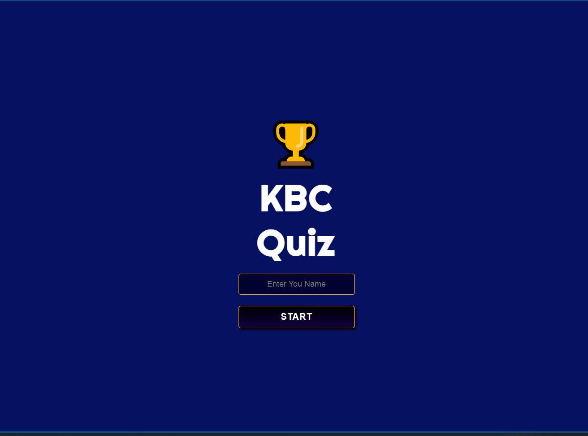
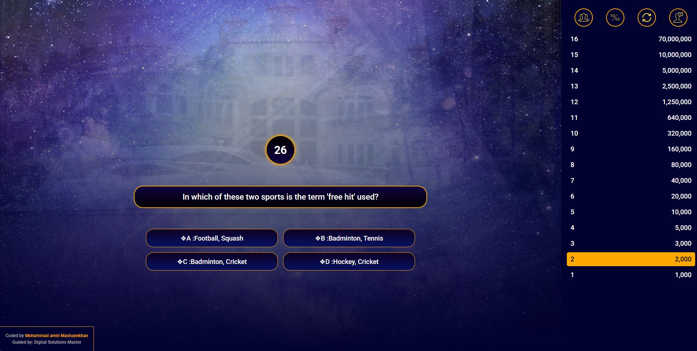

# 🧠 ReactJS KBC Quiz App

A responsive quiz application. Built using modern React architecture.

## 🔗 Live Demo

Check out the live version:  
👉 [https://reactjs-kbc-quiz-app.vercel.app/](https://reactjs-kbc-quiz-app.vercel.app/)

---

## 📸 Screenshots




---

## 🛠️ Tech Stack

This application is developed using the following technologies:

- ⚛️ **React** with functional components and **Hooks**
- 🎯 **Redux Toolkit** for global state management
- 🔊 **use-sound** for lifeline and question audio feedback
- 💅 CSS for responsive design (mobile-first)
- 🚀 Vercel for deployment

---

## 📦 Installation & Setup Instructions

To run this project locally, follow these steps:

1. **Clone the repository:**
   ```bash
   git clone https://github.com/your-username/reactjs-kbc-quiz-app.git
   cd reactjs-kbc-quiz-app
   ```

2. **Install dependencies:**
   ```bash
   npm install
   ```

3. **Run the development server:**
   ```bash
   npm start
   ```

4. **Open in browser:**
   Visit `http://localhost:3000` to start playing the quiz.

---

## 🧩 Features

- 🎮 Multiple-choice questions inspired by real quiz formats
- 📈 Score-based game progression
- 🎵 Interactive sound effects for questions and actions
- 📱  Responsive design
- ⏱️ Time-limited questions

---

## 📚 Question Sources

Questions are adapted and curated from the following publicly available resources:

1. https://serialupdates.me  
2. https://allexamgurublog.com  
3. https://topessaywriter.org/world-history-multiple-choice-questions-and-answers/

---

## 🧪 TODO / Coming Soon

- 🔜 Admin panel for question management
- 🔜 Backend for persistent state
- 🔜 Complete the lifeline feature (50:50, change current question, audience poll, call a friend)
- 🔜 Question randomization from real quiz content

---

Feel free to fork, contribute, or report issues via the GitHub repository.